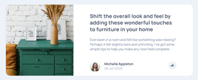
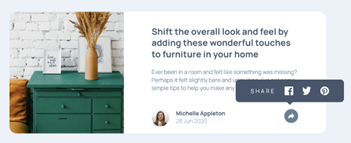
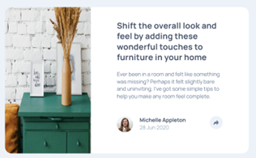
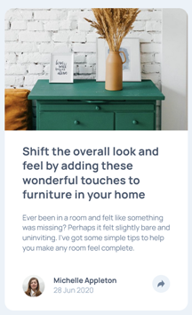
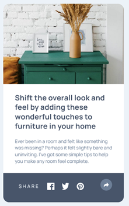

# Frontend Mentor - Article preview component solution

This is a solution to the [Article preview component challenge on Frontend Mentor](https://www.frontendmentor.io/challenges/article-preview-component-dYBN_pYFT). Frontend Mentor challenges help you improve your coding skills by building realistic projects. 

## Overview

### The challenge

Users should be able to:

- View the optimal layout for the component depending on their device's screen size
- See the social media share links when they click the share icon

### Screenshot

### Links

- Solution URL: [https://github.com/toshirokubota/article-preview-component](https://github.com/toshirokubota/article-preview-component)
- Live Site URL: [https://toshirokubota.github.io/article-preview-component/](https://toshirokubota.github.io/article-preview-component/)

## My process

### Built with

- Semantic HTML5 markup
- CSS custom properties
- Flexbox
- CSS Grid
- Mobile-first workflow

### What I learned

- Placing a part of an image without cropping it. 

- Implementing a tooltip.

### Continued development

I keep practicing various layout techniques and focus on writing clean code.

### Useful resources

- [tooltip with an arrow] (https://www.w3schools.com/css/css_tooltip.asp) - this page shows an example of how to make an arrow on a tooltip.
